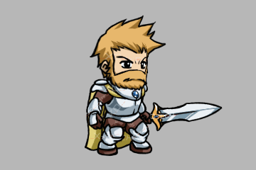

# PlayCanvas Spine

Spine plugin for PlayCanvas Engine



## Usage

### Editor

Add the files `lib/playcanvas-spine.min.js` and `src/script/spline.js` to your project. 

Create an Entity with a Script Component and add the spine entity script `spine` to your Entity. Upload your exported spine resources (atlas, skeleton json file, textures) and attach them to the spine script on your Entity.

### Engine-only

Include the library script `lib/playcanvas-spine.min.js`. Either use the script `src/script/spine.js` in script components or directly add spine components to your Entities.

```javascript
var entity = new pc.Entity();
entity.addComponent("spine", {
    atlasAsset: atlas, // atlas text asset
    textureAssets: textures,  // texture assets
    skeletonAsset: skeleton // skeleton json asset
});
```

## Building

If you don't already have it installed, install Grunt.

`npm -g install grunt`

Install package dependencies

`npm install`

Run grunt to build

`grunt`

## Notes

This plugin uses the spine-ts runtime and is built from version 3.6
